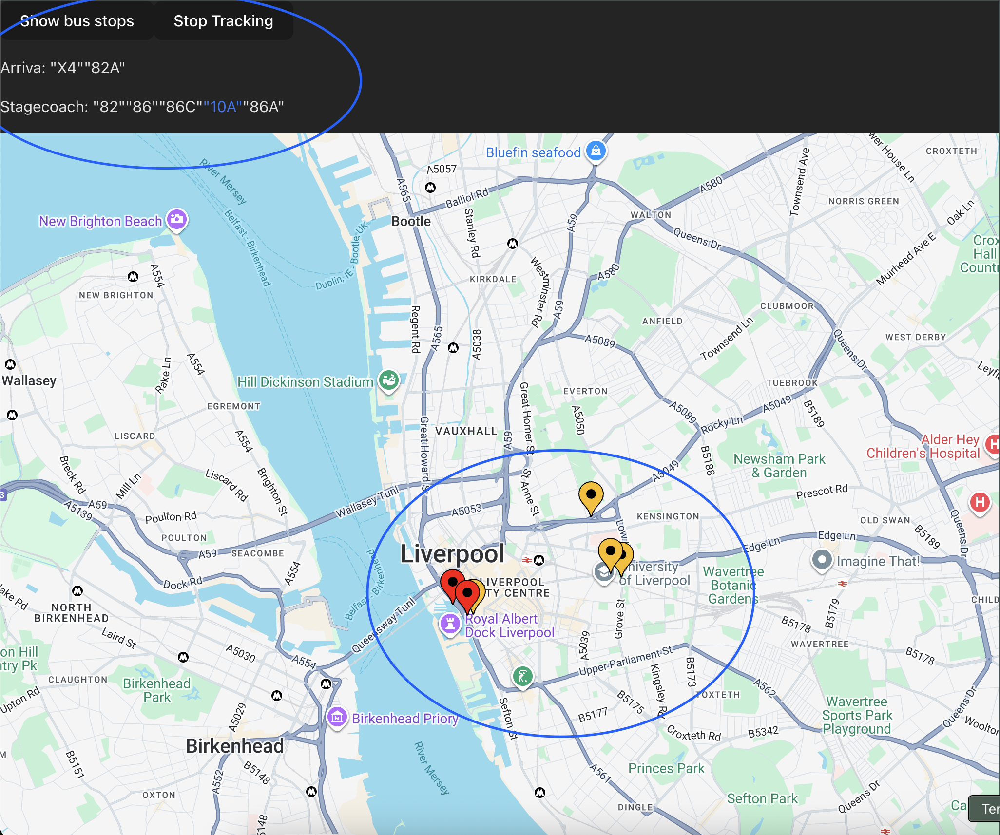

# Bus Tracker V2
Building an improved bus tracker this time using react/ts and the google maps api

# Current Features
- Currently displays a select number of bus stops.
- Each stop can be clicked on, showing the buses from the selected stop and from the relevant company (arriva/ stagecoach)
- Each service can be clicked on, once clicked, the location of each bus of that service is displayed on the map
- User gets told if a selected service has no buses out on the roads
- Polling of API happens every 10 seconds to get new location data automatically

# Features in progress
- Legend for icons
- Showing buses incoming to the bus stop
- Only showing buses within the Liverpool region as sometimes buses with the same service number in other cities are displayed
- General code cleanup

# Image of UI + console
- Yellow pins are the bus stops
- Red pins are the busses from selected bus (the "17" highlighted in blue)

# Current blockers
