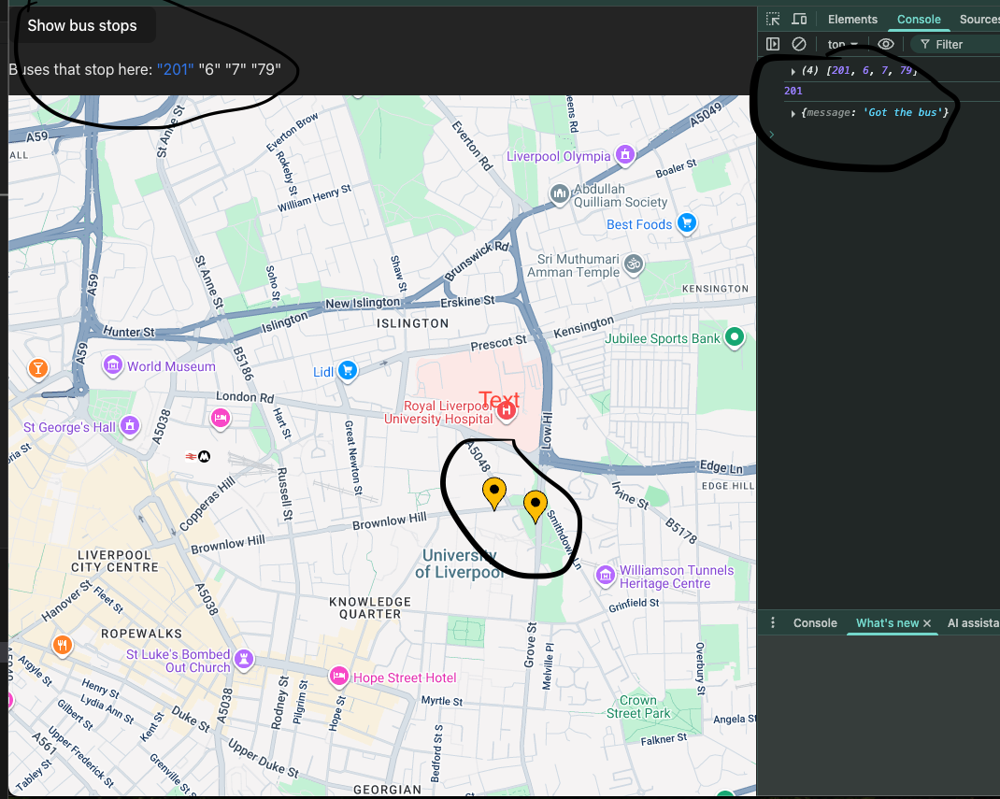

# Bus Tracker V2
Building an improved bus tracker this time using react/ts and the google maps api

# Current Features
- Currently displays a select number of bus stops.
- Each stop can be clicked on, showing the buses from the selected stop.
- Each bus can be clicked on, with the goal being location data about that bus sent back from the server. Right now the server just sends back a generic message.

# Features in progress
- Sending back bus location to be displayed in the frontend.
- Having the bus stops show directly on load, right now they only show after the "Show bus stops" button is clicked.

# Image of UI + console

# Current blockers
- Trying to understand the location data im getting from Gov.UK as sometimes buses seem to be randomly missing from the dataset provided

