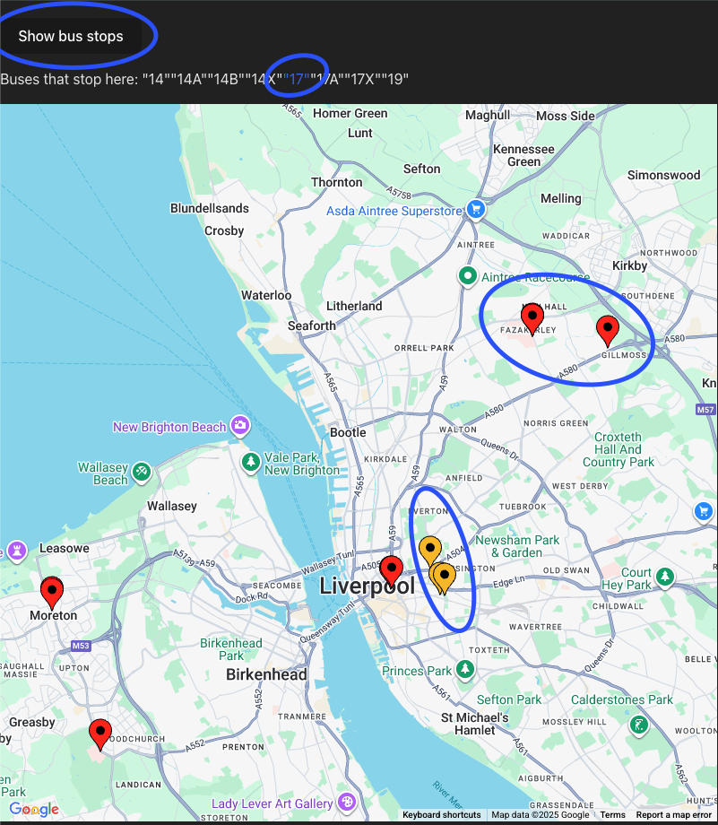

# Bus Tracker V2
Building an improved bus tracker this time using react/ts and the google maps api

# Current Features
- Currently displays a select number of bus stops.
- Each stop can be clicked on, showing the buses from the selected stop.
- Each bus can be clicked on, once clicked, the location of each bus of that line is displayed on the map

# Features in progress
- Having the bus locations be updated every 10 seconds (which is the same time as which the actual Gov.UK api updates)
- Letting the user know which of the bus options have no buses out on the roads
- Legend for icons
# Image of UI + console
- Yellow pins are the bus stops
- Red pins are the busses from selected bus (the "17" highlighted in blue)

# Current blockers
- Trying to find a way to keep making API calls every 10 seconds to update location data.
- Learning about websockets so the backend data can continuously send fresh data to the frontend.
